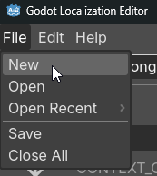
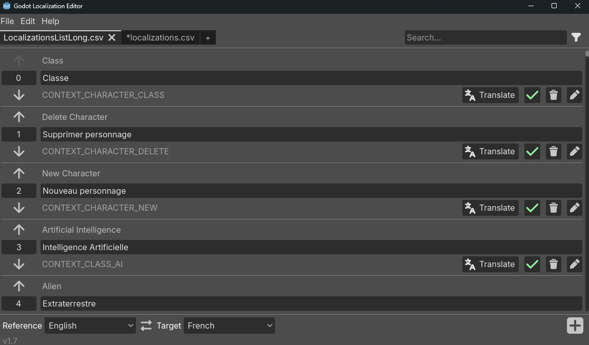
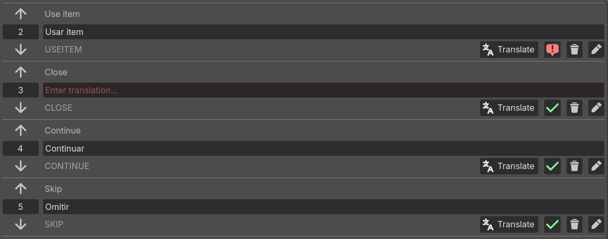
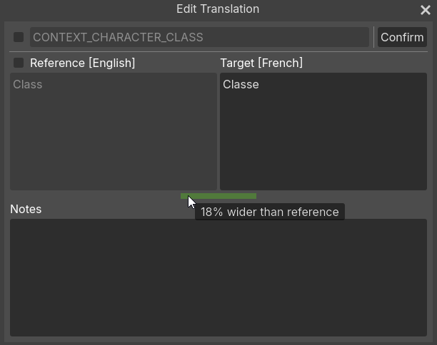
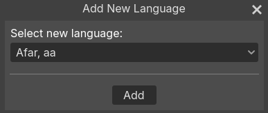
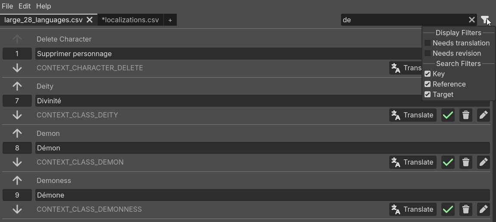
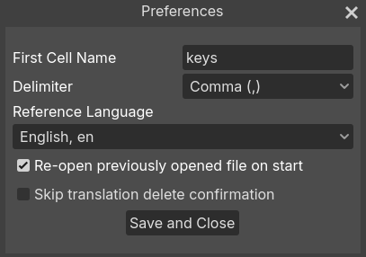

# Godot Localization Editor
Godot Localization Editor is a tool for managing CSV translation files for use within the Godot game engine.

    <picture>
    <source media="(prefers-color-scheme: dark)" srcset="images/banner-dark.svg">
    <source media="(prefers-color-scheme: light)" srcset="images/banner-light.svg">
    
    </picture>

## Table of Contents
- [Original Project](#original-project)
- [Features](#features)
- [Installation](#installation)
  - [Godot Plugin](#godot-plugin)
  - [Standalone](#standalone)
- [Usage Guide](#usage-guide)
  - [New/Open File](#newopen-file)
  - [Multiple Files](#multiple-files)
  - [Editing Translation Entries](#editing-translation-entries)
  - [Reordering Entries](#reordering-entries)
  - [Managing Languages](#managing-languages)
  - [Search and Filter](#search-and-filter)
  - [Autosave and Recovery](#autosave-and-recovery)
  - [Settings](#settings)

## Original Project
This project was inspired, forked, and upgraded to Godot 4 from [dannygaray60/localization-editor-g3](https://github.com/dannygaray60/localization-editor-g3).

## Features
- Add/Edit/Delete translation entries from a CSV file in an easy-to-read format
- Open and work on multiple CSV files simultaneously using tabs
- Fast virtual scrolling for large translation files
- Search entries by key, reference translation, or target translation
- Filter entries that are missing translations or marked for revision
- Add notes to an entry for better collaboration
- Autosave with crash recovery to protect unsaved changes
- Use as a standalone tool or as a Godot plugin
- Optional automatic translations using Google Translate API
- Free and Open Source!

## Installation
The standalone binaries and plugin zip files can both be found on the [GitHub Releases](https://github.com/EthanGrahn/godot-localization-editor/releases) page. Releases are versioned in the format of `<plugin version>-gd<engine version>`. Releases with "_NoGoogle" in the name will not include the Google Translate API.

NOTE: Releases prior to version 2 do not include the plugin zip files.

### Godot Plugin
Unzip the plugin zip file from the releases page into your Godot project. This will unpack it into `addons/localization_editor`.

### Standalone
Download the latest version from the releases page and run the .exe (Windows) or .x86_64 (Linux).

## Usage Guide

### New/Open File
Go to File > New or File > Open to create a new CSV file or open an existing one. Recently opened files are available under File > Open Recent.

### Multiple Files
Multiple files can be open at the same time. Each open file appears as a tab at the top of the editor. Click the **+** tab or use File > Open to add another file. Click the **×** on a tab to close it, or use File > Close All to close everything.

Tabs marked with **\*** have unsaved changes. Use **Ctrl+S** or File > Save to save the active file. Language selections (reference and target) are saved per file and restored automatically when switching between tabs.

### Editing Translation Entries
Once a file is created or opened, each translation key will have a corresponding row in the window. These rows will display the key, reference language, and target language. The reference and target languages can be changed using the dropdowns in the bottom left of the window. Use the swap button (⇄) to quickly exchange the two language selections. The entries will be red when they are missing a translation and will display an exclamation mark if they have been marked as needing revision. To automatically translate an entry using Google Translate, press the "Translate" button below that entry.

Selecting the "Edit" button will open a popup window where you can edit the key, reference language, target language, and add notes. The bar above the "Notes" text box shows the estimated visual difference in how the different translations will render. This may be useful in determining how UI elements in your project will scale depending on the language.

### Reordering Entries
Each entry has up/down arrow buttons to move it one position at a time. You can also type a specific position number into the index field on an entry and press Enter to jump it directly to that position.

### Managing Languages
Within the Edit dropdown menu, there are options for adding or removing languages. These options will create or delete corresponding language columns in the CSV file.

### Search and Filter
Use **Ctrl+F** to quickly focus the search bar. Type in the search bar to filter the visible entries. Click the filter button next to the search bar to open the filter menu, which provides two categories of options:

- **Display Filters** - show only entries that need translation or entries marked as needing revision
- **Search Filters** - restrict the text search to the key, reference text, or target text fields

### Autosave and Recovery
Changes are automatically saved to a temporary file in the background. If the editor closes with unsaved changes, a recovery dialog appears the next time that file is opened, letting you restore or discard the unsaved work.

### Settings
Go to Edit > Preferences to configure:

- **First Cell Label** - the text used in the first CSV cell (commonly `keys`)
- **Delimiter** - the character used to separate columns in the CSV file (comma, semicolon, or tab)
- **Default Reference Language** - the language shown as the reference when a file is first opened
- **Reopen Last Files** - automatically reopen files from the previous session on startup
- **Skip Delete Confirmation** - skip the confirmation dialog when deleting a translation entry

