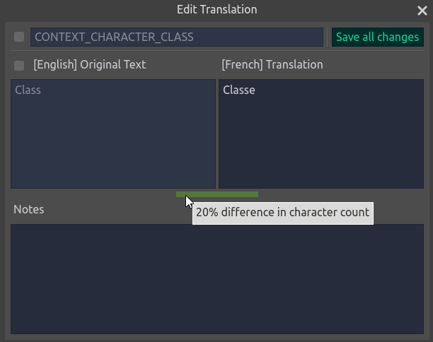

# Godot Localization Editor
Godot Localization Editor is a tool for managing CSV translation files for use within the Godot game engine.

## Table of Contents
- [Original Project](#original-project)
- [Features](#features)
- [Installation](#installation)
  - [Godot Plugin](#godot-plugin)
  - [Standalone](#standalone)
- [Usage Guide](#usage-guide)
  - [New/Open File](#newopen-file)
  - [Editing Translation Entries](#editing-translation-entries)
  - [Managing Languages](#managing-languages)

## Original Project
This project was inspired, forked, and upgraded to Godot 4 from [dannygaray60/localization-editor-g3](https://github.com/dannygaray60/localization-editor-g3)

## Features
- Add/Edit/Delete translation entries in CSV file
- Use as a standalone tool or as a Godot plugin
- Optional automatic translations using Google Translate API
- Free and Open Source!

## Installation

### Godot Plugin
Copy the `addons/localization_editor` folder into your Godot project's `addons` folder. Exclude `addons/localization_editor/google_translate` if you do not want the Google Translate API included.

### Standalone
Download the latest version from the [GitHub Releases](https://github.com/EthanGrahn/godot-localization-editor/releases) page and run the .exe (Windows) or .x86_64 (Linux). Executables with `_NoGoogle` in the name do not include the Google Translate API.

## Usage Guide

### New/Open File
Go to File > New File or File > Open File to create a new CSV file or open and existing one.

### Editing Translation Entries
Once a file is created or opened, each translation key will have a corresponding row in the window. These rows will display the key, reference language, and target language. The reference and target languages can be changed using the options in the top right of the window. The entries will be red when they are missing a translation and will display an exclamation mark if they have been marked as needing revision. To automatically translate an entry using Google Translate, click into the text box then press the "Translate" button below that entry.

Selecting the "Edit" button will open a popup window where you can edit the key, reference language, target language, and add notes.

### Managing Languages
Within the Edit dropdown menu, there are options for adding or removing languages. These options will create or delete corresponding language columns in the CSV file.

